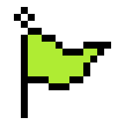
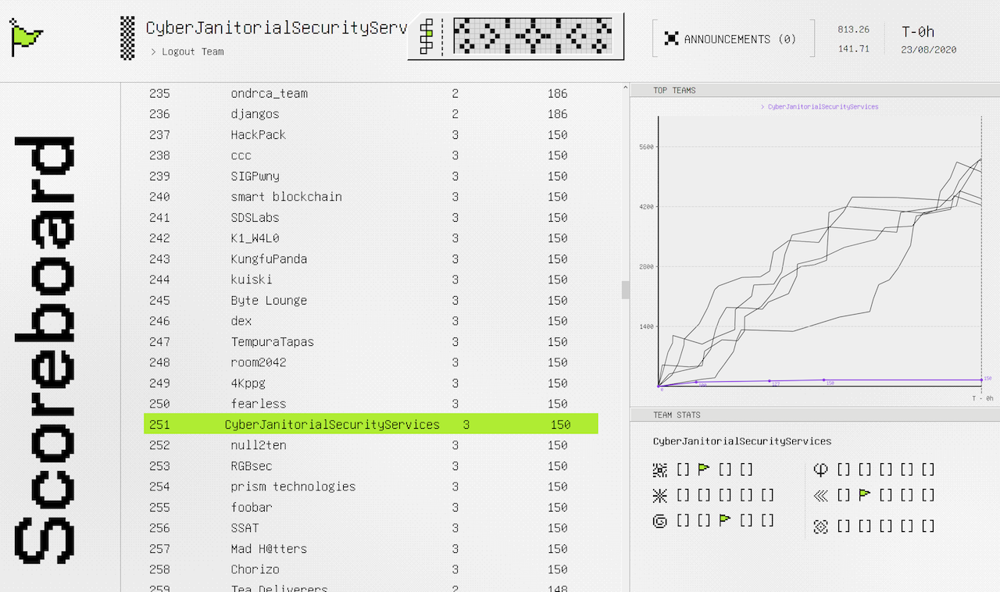

#    Google CTF 2020

This repo hosts my write-ups for the Google CTF 2020 challenges that I solved as a member of the CyberJanitorialSecurityServices team!

I solved three challenges during the competition, and one about an hour after the competition ended. All four have complete solutions here. 

## Challenges

###  Hardware 

* **[BASICS](hardware/basics)**

###  Web

* **[PASTEURIZE](web/pasteurize)**

###  Reversing

* **[BEGINNER](reversing/beginner)**
* **[ANDROID](reversing/android)**

## Scoreboard

